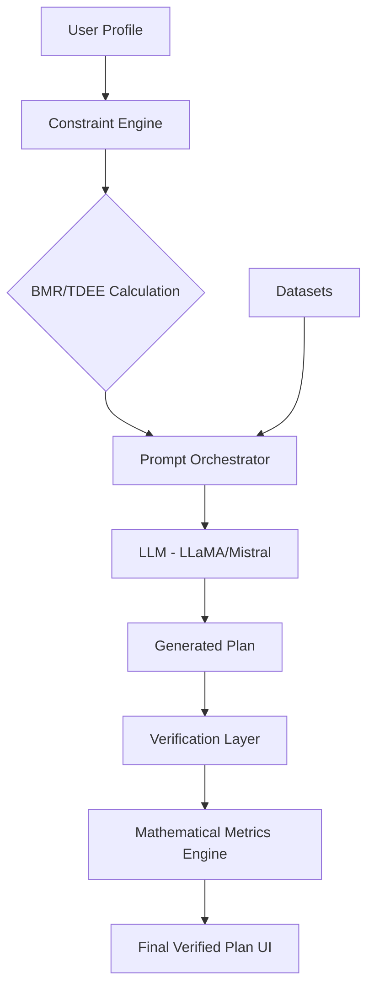

# 💪 Constraint-Aware AI Fitness Planner

A sophisticated **Generative AI System** designed to bridge the gap between creative LLM generation and rigid biological constraints. Built for the Amrita Vishwa Vidyapeetham Generative AI Course (Team 32).

---

## 🌟 The Core Innovation
Most AI fitness tools simply "ask" an LLM for a plan. This project implements a **Verifiable Pipeline**:
1. **Mathematical Grounding**: Real-time biological metrics (BMR, TDEE) calculated via Mifflin-St Jeor.
2. **Orchestrated Generation**: The LLM is used as a reasoning engine, guided by specific exercise datasets and nutritional thresholds.
3. **Closed-Loop Validation**: A separate validation layer parses generated text back into data to verify calorie and protein compliance.

---

## 🚀 Key Features
- **Premium Hand-Crafted UI**: A high-contrast, modern Streamlit dashboard with a warm earthy aesthetic.
- **Dual Interface**: Supports full-speed API (Groq/LLaMA 3) or local private models (Mistral/HuggingFace).
- **Data-Driven**: Uses real CSV datasets (275K+ food items, 2.9K+ exercises) for factual grounding.
- **Scientific Metrics**: Implements specific mathematical scores (CCSS, PAR, WBS) to measure AI accuracy.

---

## 🏗️ Architecture


---

## 📊 Evaluation System
The project doesn't just generate text; it evaluates its own performance using four unique metrics:
- **CCSS**: Calorie Constraint Satisfaction Score (How close did the AI get to target calories?)
- **PAR**: Protein Adequacy Ratio (Did the AI provide enough protein for the goal?)
- **WBS**: Workout Balance Score (Did the AI hit all the required muscle groups?)
- **CCR**: Overall Compliance Rate (Success percentage of the total pipeline).

---

## 🛠️ Setup & Usage

1. **Install Dependencies**:
   ```bash
   pip install -r requirements.txt
   ```

2. **Run Application**:
   ```bash
   streamlit run app/app.py
   ```

3. **Experiments Mode**:
   For automated batch testing of multiple profiles:
   ```bash
   python main.py
   ```

---

## 📂 Project Highlights
- **`src/constraint_engine.py`**: The "Science Layer" — contains all biological formulas.
- **`src/validator.py`**: The "Judge Layer" — parses text back into math for verification.
- **`app/app.py`**: The "Interface Layer" — premium custom CSS dashboard.

---

## 👨‍💻 Note for Reviewers
This project demonstrates the transition from a simple "Prompt Engineer" to a **"GenAI Architect."** It solves the critical problem of LLM hallucinations in health-tech by enforcing scientific constraints through a multi-layered validation pipeline.

---
*Developed for Academic Purposes only. Not medical advice.*
